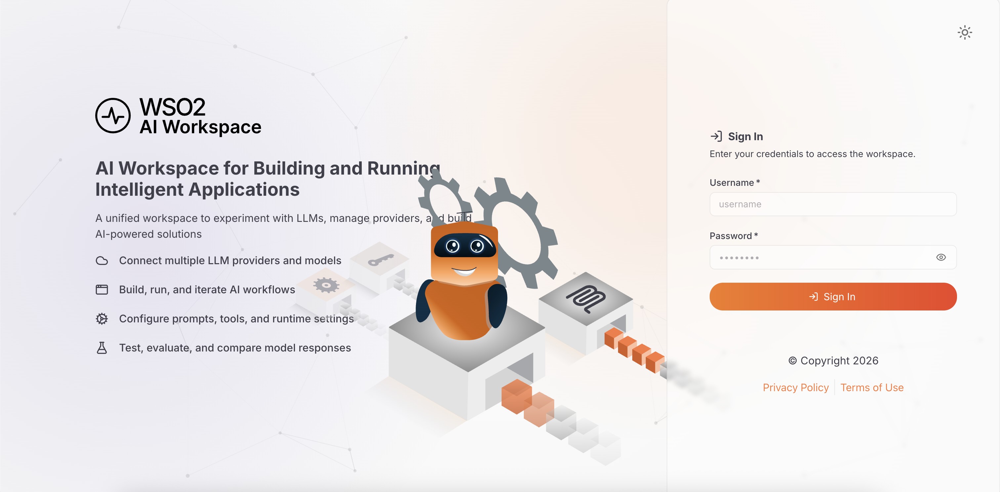

# Get started with AI Workspace

The AI Workspace lets you manage AI gateways and large language model (LLM) providers. This guide gets AI Workspace running locally with Docker Compose, then walks you through creating your first AI gateway and LLM provider.

## Prerequisites

- [Docker](https://docs.docker.com/get-docker/) with the Compose plugin, or another Compose-compatible container runtime such as Podman
- Ports **9643** and **9243** available on your machine. If either one is taken, see [Change the ports AI Workspace uses](setting-up/ports.md).
- `curl` and `unzip` installed

This guide shows commands with `docker compose`. If you use Podman or another Compose-compatible runtime, run the equivalent compose command instead, such as `podman compose up -d`.

## Step 1: Download AI Workspace

Run this command in your terminal to download and unzip AI Workspace:

```bash
curl -sLO https://github.com/wso2/api-platform/releases/download/portals/ai-workspace/v1.0.0-rc3/wso2apip-ai-workspace-1.0.0-rc3.zip && \
unzip wso2apip-ai-workspace-1.0.0-rc3.zip
```

## Step 2: Run the setup script

```bash
cd wso2apip-ai-workspace-1.0.0
./scripts/setup.sh
```

Run the script once before the first start. The stack never auto-generates keys or certificates. If something a service needs is missing, that service fails closed with a descriptive error rather than starting with a weaker value.

The script prompts for the admin username and password. Press <kbd>Enter</kbd> at each prompt to accept `admin` and a randomly generated password. The script provisions the following:

| Artifact | Location | Purpose |
|----------|----------|---------|
| Transport Layer Security (TLS) certificate | `resources/certificates/cert.pem` and `key.pem` | Self-signed HTTPS pair shared by the services. |
| RS256 JSON Web Token (JWT) signing keypair | `resources/keys/jwt_private.pem` and `jwt_public.pem` | The Platform API signs login tokens with the private key; AI Workspace and the API Portal verify them with the public key. There's no shared hash-based message authentication code (HMAC) secret. |
| At-rest encryption key | `resources/keys/encryption.key` | The Platform API's 32-byte key for encrypting stored secrets, subscription tokens, and WebSub HMAC secrets. **Retain it** — losing or changing it makes previously-encrypted data unreadable. |
| API Portal encryption key | `resources/keys/api-portal-encryption.key` | Encrypts the API Portal's subscription and webhook secrets at rest. Retain it for the same reason. |
| API Portal session secret | `resources/keys/api-portal-session-secret` | Signs API Portal session cookies. Rotating it only signs users out. |
| Admin credentials | `api-platform.env` | The Platform API's basic-auth admin user: `APIP_CP_ADMIN_USERNAME` plus the bcrypt `APIP_CP_ADMIN_PASSWORD_HASH`. |
| Compose defaults | `.env` | `COMPOSE_PROFILES`, which decides the services a plain `docker compose up` starts, and `COMPOSE_PROJECT_NAME`, which namespaces this copy's containers, networks, and volumes. |


!!! warning "Save the printed admin username and password"
    The admin password is shown only once, and `api-platform.env` holds only its bcrypt hash. To set a new one, delete both `APIP_CP_ADMIN_USERNAME` and `APIP_CP_ADMIN_PASSWORD_HASH` from `api-platform.env` and rerun `./scripts/setup.sh`. Deleting only one of the two makes the script stop with an error, because a username without its matching hash can never authenticate.

!!! warning "Don't delete or edit `COMPOSE_PROJECT_NAME`"
    The project name is pinned on the first run and never changes afterward — not on a rerun, not under any flag. The stack's data lives in volumes prefixed with it, so a different name starts the stack with an empty database. To choose the name yourself, set `COMPOSE_PROJECT_NAME` in the environment for the first run.

## Step 3: Start the stack

```bash
docker compose up
```

!!! tip "Port 9643 or 9243 already taken?"
    If `docker compose up -d` fails with a port binding error, identify what is already listening on the default ports:

    On macOS or Linux, run:

    ```bash
    lsof -nP -iTCP:9643 -sTCP:LISTEN
    lsof -nP -iTCP:9243 -sTCP:LISTEN
    ```

    On Windows PowerShell, run:

    ```powershell
    Get-NetTCPConnection -State Listen -LocalPort 9643,9243 | Select-Object LocalAddress, LocalPort, OwningProcess
    ```

    Stop the conflicting service if you don't need it. If you need to keep it running, change the host-side `ports:` mapping in `docker-compose.yaml` before you start. For example, use `"9743:9643"` for AI Workspace. Open AI Workspace on the remapped host port in the next step. For example, use `https://localhost:9743` instead of `https://localhost:9643`. See [Change the ports AI Workspace uses](setting-up/ports.md) for the two config keys that need to match.

## Step 4: Open AI Workspace

Open `https://localhost:9643` and sign in with the admin credentials that `setup.sh` printed:



!!! tip "Browser trust warning?"
    The generated TLS certificates are self-signed. Click **Advanced > Proceed** to continue, then return to the workspace.

!!! note "About this login"
    These credentials come from file-based authentication, generated by the setup script and stored in your local environment configuration. Use them to try AI Workspace locally. Before you move to a production or shared environment, connect an identity provider to manage user login. See [Authentication in AI Workspace](setting-up/authentication/overview.md).

## Step 5: Create an AI Gateway

An AI gateway is the runtime that processes and routes requests between your applications and LLM providers. You need at least one gateway before configuring providers or proxies.

1. Navigate to **AI Gateways** in the left navigation menu.
2. Click **+ Add AI Gateway**.
3. Fill in the **Name** and **URL**, then click **Add Gateway**.
4. Copy the **Gateway Registration Token** and save it securely straight away—it's shown only once. Then follow the setup instructions to start the gateway runtime.
5. Once connected, the gateway status changes from **Not Active** to **Active**.

For detailed instructions, see [Set up an AI Gateway](ai-gateways/setting-up.md).

## Step 6: Configure an LLM provider

An LLM provider connects AI Workspace to an AI service platform such as OpenAI, Anthropic, or Azure OpenAI.

1. Navigate to **LLM** > **LLM Providers**.
2. Click **+ Add New Provider** and select your provider type.
3. Fill in the **Name**, **Version**, and **API Key**, then click **Add Provider**.
4. Configure how applications authenticate when they access this provider through the gateway.
5. Click **Deploy to Gateway** and select your active gateway.

For detailed instructions, see [Configure an LLM provider](llm-providers/configure-provider.md).

## Rerun the setup script

Rerunning `./scripts/setup.sh` is safe. By default it fills in only what's missing and never overwrites a value that already exists. The flags change that:

| Flag | Effect |
|------|--------|
| `--force` | Regenerate the TLS certificate, the JWT keypair, and the API Portal session secret, and rotate the admin credentials. Never touches either encryption key. |
| `--rotate-encryption-key` | Replace `resources/keys/encryption.key` and `resources/keys/api-portal-encryption.key`, even though they exist. Destructive — see the warning below. |
| `--certs-only` | Generate only the TLS certificate. Skips the keys, the admin credentials, and `api-platform.env`. |
| `--profiles=<a,b,...>` | Write a different `COMPOSE_PROFILES` value to `.env`, for example `--profiles=platform-api` or `--profiles=platform-api,api-portal`. |

To rotate a single value by hand, delete it from `api-platform.env` — or delete the file under `resources/certificates` or `resources/keys` — and rerun the script.

!!! warning "Rotating an encryption key destroys encrypted data"
    `--rotate-encryption-key` replaces both encryption keys, which makes everything encrypted under the old keys permanently unreadable. That covers stored [AI Workspace secrets](secrets-management.md), subscription tokens, and WebSub HMAC secrets held by the Platform API. It also covers the API Portal's subscription secrets and webhook secrets. At an interactive terminal the script asks you to type `rotate` to confirm; in a non-interactive run, passing the flag is itself the confirmation. Rotating the JWT keypair with `--force` is milder — it only invalidates issued login tokens, so everyone signs in again.

## Provision the at-rest encryption key manually

If you don't run `setup.sh`, provision the at-rest encryption key yourself before the first start. It protects [AI Workspace secrets](secrets-management.md), subscription tokens, and WebSub HMAC secrets, and the Platform API refuses to start if it's missing or malformed. Keep it stable across restarts and replicas.

The key is a single 32-byte AES-256 value, supplied as 64 hex characters or base64. Generate it and write it to the file the container mounts at `/etc/platform-api/keys`. Create the file so that only its owner can read it:

```sh
(umask 077 && openssl rand -hex 32 > resources/keys/encryption.key)
chmod 600 resources/keys/encryption.key
```

Keep the key out of source control, alongside `api-platform.env`. A trailing newline is trimmed on load. The Platform API doesn't read the key from an environment variable directly. It reads the `encryption_key` field in `config.toml`, which pulls the value in through an interpolation token:


```toml
# config.toml - resolved from a mounted key file:
encryption_key = '{{ file "/etc/platform-api/keys/encryption.key" }}'

# Alternatively, from an environment variable:
# encryption_key = '{{ env "APIP_CP_ENCRYPTION_KEY" }}'
```


To use the environment variable form instead, switch the token to `{{ env "APIP_CP_ENCRYPTION_KEY" }}` and set the variable in `api-platform.env`. For how these tokens work, see [AI Workspace configuration and environment interpolation](setting-up/configuration.md).

## Change environment values after setup

`api-platform.env` holds the values the containers read at startup. Those are the admin credentials the setup script wrote, plus anything else your `config.toml` pulls in through an `{{ env }}` token. Edit that file to change a setting, for example to switch the AI Workspace login mode or point at a different control plane. Then restart the stack.

The sample `docker-compose.yaml` loads the file with the `env_file:` directive. It sets `format: raw` so that the `$` characters in a bcrypt password hash aren't treated as Compose interpolation:

```yaml
services:
  platform-api:
    env_file:
      - path: api-platform.env
        required: true
        format: raw
```

Keep `api-platform.env` out of source control. It's git-ignored in the distribution.

## Next steps

- [Manage an LLM provider](llm-providers/manage-provider.md): configure connection, access control, security, rate limiting, guardrails, and models
- [Configure an App LLM proxy](llm-proxies/configure-proxy.md): create a specialized endpoint for one application or agent
- [Manage an App LLM proxy](llm-proxies/manage-proxy.md): configure provider settings, resources, security, and guardrails

!!! note
    Create an App LLM proxy only when a specific GenAI application or agent needs its own guardrails, authentication, exposed resources, or routing on top of a provider.
