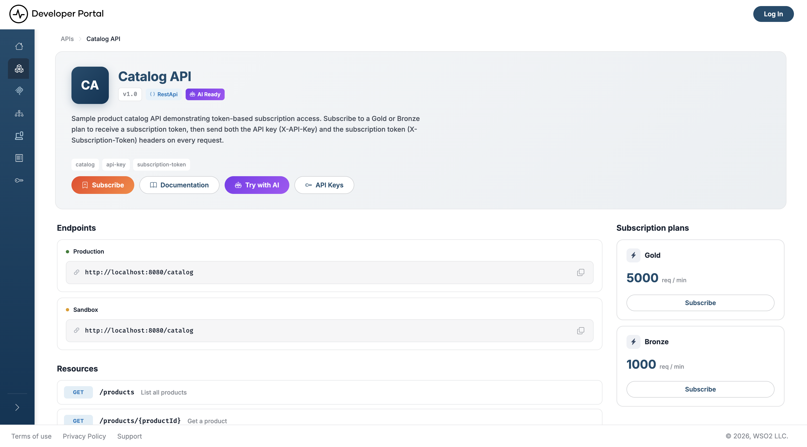

# API overview

Every API's overview page summarizes what the API does, how to reach it, and how to start consuming it. Read it before you dig into the full [documentation](api-documentations.md).

## View an API's overview page

1. Go to **APIs** in the sidebar and [search or browse](api-search.md) for the API you want.
2. Click the API's card to open it. The overview page loads by default.

    The overview page gathers the API's identity, endpoints, operations, and plans on one screen:

    

## What you'll find

The header shows the API's icon, name, version, and description, along with tags (informational only, not clickable filters) and the following badges:

- **Type**: the API type—REST, GraphQL, WebSocket, WebSub, or SOAP
- **AI Ready**: shown when the API is visible to AI agents
- **Deprecated**: shown when the API has been deprecated

### Action buttons

- **Subscribe**: jumps down to the subscription plans. Shown when the API has plans and you aren't subscribed to one yet
- **Documentation**: opens the API's full documentation. SOAP APIs show a **Download** button for the WSDL file instead
- **Try with AI**: opens a modal with a ready-made prompt that briefs an AI agent on the API, using its [machine-readable documentation](ai-agent-discovery.md). Shown when the API is agent-visible. From the modal you can copy the prompt, download it as a `.txt` file, or send it straight to an assistant with **Run in Claude**.
- **API Keys**: opens the API Keys page, where you generate a key. Shown for REST, WebSocket, and WebSub APIs whose specification declares API key security, and never for GraphQL, SOAP, or MCP artifacts.

### Page sections

- **Endpoints**: the Production and Sandbox base URLs, each with a copy button
- **Resources**: for REST and SOAP APIs, every operation with its HTTP method, path, and summary
- **Channels**: for WebSocket and WebSub APIs, every channel. WebSocket channels carry both a PUB and a SUB badge; WebSub channels carry SUB only
- **Scopes**: for REST and SOAP APIs, the OAuth2 scopes the API defines. The section states when the API defines none
- **Subscription plans**: a side panel listing the plans available for this API, such as Gold and Bronze, with the rate limit each one enforces.

GraphQL APIs show the Endpoints section only. Their operations live in the schema, which you reach through **Documentation**.

### Subscribing from this page

Each plan in the **Subscription plans** panel carries its own button:

- **Subscribe** creates a subscription to that plan and shows the subscription token, which you send in the header the API's specification names, commonly `Subscription-Key`. If you aren't signed in, the button takes you to the login page first.
- **View subscription** replaces it on the plan you already hold, and opens a dialog where you can reveal or copy the token, regenerate it, suspend the subscription, or unsubscribe.

For the full flow, see [Manage Subscriptions](../manage-subscriptions.md).

!!! note
    Model Context Protocol (MCP) servers have their own overview page with a similar layout. It shows the server's **MCP Server URL**, **Tools**, **Resources**, and **Prompts**, plus an **MCP Server Configuration** snippet you can paste into an MCP client. See [Discover MCP Servers](../mcp-servers/discover-mcp-servers.md).

## Related

- [Search APIs](api-search.md): find the API you want to open
- [Customize an API's Content](../admin-settings/api-content.md): replace this generated body with your own
- [API Documentation](api-documentations.md): full endpoint, schema, and security details
- [Manage Subscriptions](../manage-subscriptions.md): subscribe, switch plans, and manage your subscription token
- [Manage API Keys](../manage-api-keys.md)
- [AI Agent Discovery](ai-agent-discovery.md): the machine-readable documentation behind **Try with AI**